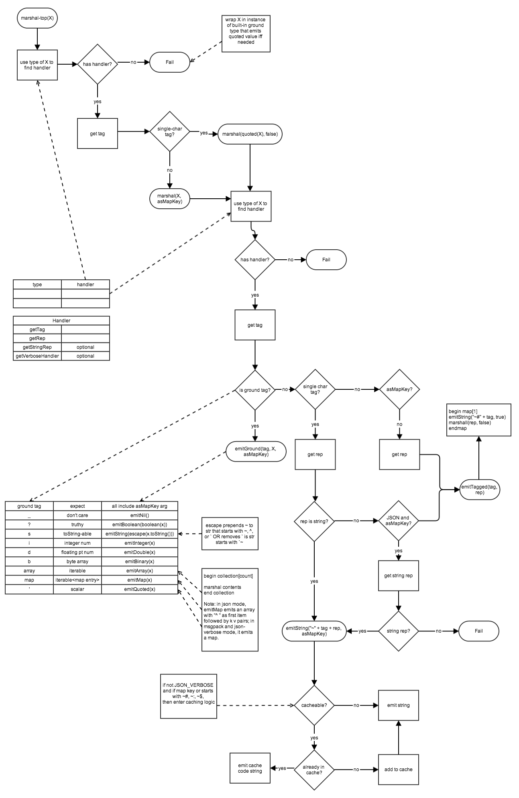
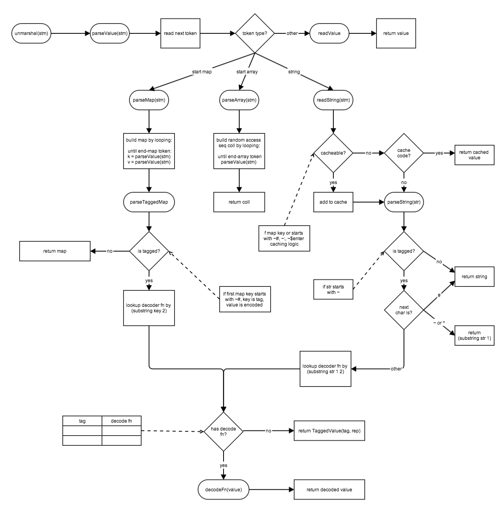

# Transit 

*Version:* 0.8

Transit is an extensible data notation for conveying values, primarily for program-to-program communication. This spec describes Transit in order to facilitate the implementation of readers and writers in a wide range of languages. 
Transit provides a set of basic of elements and a set of extension elements for representing values. The extension mechanism is open, allowing programs using to add new elements specific to their needs. Users of data formats without such facilities must rely on either convention or context to convey elements not included in the base set, making application code much more complicated. With Transit, convention and context-sensitive logic are unnecessary. 

Transit is designed to be implemented on top of formats for which high performance processors already exist, specifically JSON and MessagePack. Transit uses these formats' native representations for built-in elements, e.g., strings and arrays, wherever possible. Extension elements which have no native representation in these formats, e.g., dates, are represented using a tag-based encoding scheme. Transit also supports compression via caching of repeated elements, e.g., keys used in an array of maps, that can significantly reduce payload size.

The design of Transit is focused on program-to-program communication, as opposed to human readability. While it does support an explicit verbose mode for representing Transit elements in JSON, Transit is not especially well suited for situations where human readability is paramount. 

Transit processes elements in terms of semantic types, but it is not a type system, and has no schemas. Nor is it a system for representing object graphs - there are no reference types, nor should a consumer have an expectation that two equivalent elements in some body of Transit will yield distinct object identities when read, unless a reader implementation goes out of its way to make such a promise. Thus the resulting values should be considered immutable, and a reader implementation should yield values that ensure this, to the extent possible. 

Transit defines the encoding of elements. A use of transit might be a stream or file containing a series of elements, but it could be as small as the conveyance of a single element in e.g. an HTTP query param.

The base set of built-in and extension elements in Transit is meant to cover the basic set of data structures common to most programming languages. While Transit specifies how those elements are formatted in text, it does not dictate the representation on either the producer or consumer side. A well behaved implementation library should endeavor to map the elements to programming language types with similar
semantics. 

# Specification

## Version

This is version 0.8 of the Transit specification.

## Implementations

There are implementations for the following languages:

* [Clojure](http://github.com/cognitect/transit-clj)
* [ClojureScript](http://github.com/cognitect/transit-cljs)
* [Java](http://github.com/cognitect/transit-java)
* [JS](http://github.com/cognitect/transit-js)
* [Python](http://github.com/cognitect/transit-python)
* [Ruby](http://github.com/cognitect/transit-ruby)

## How it works

Transit is defined in terms of an extensible set of elements used to represent values. The elements correspond to semantic types common across programming languages, e.g., strings, arrays, URIs, etc. When an object is written with Transit, a language-specific Transit library maps the object's type to one of supported semantic types. Then it writes the object out to MessagePack or JSON using the rules defined for that semantic type. Whenever possible, data is written directly to MessagePack or JSON using those protocols' built-in types. For instance, a string or an array from any language is always just represented as a string or an array in MessagePack or JSON. When a value cannot be represented directly as a built-in type in MessagePack or JSON, it must be encoded. Encoding captures the semantic type and value of the data in a form that can be represented as a built-in type in MessagePack or JSON, either a string or an object (map). 

When Transit data is read, any encoded values are decoded and programming language appropriate representations are produced.

Transit defines the rules for encoding and decoding semantically typed values. It does not define how encoded data is stored, transmitted, or otherwise used.

### Tag-based encoding

When necessary, Transit encodes values are as a tag indicating their semantic type and the value represented in a form that can be represented directly in MessagePack or JSON or which can itself be encoded. Each of the semantic types that Transit supports has a unique tag. Scalar values have single-character tags and composite values have multi-character tags. When a value cannot be directly represented in MessagePack or JSON, it is encoded one of two ways:
* as a string  ```"~" + tag-char + value-str```
* as an object ```{"~#tag" : value}```

The table below lists all of the built-in semantic types and their corresponding tags. The rows highlighted in green represent ground types. In general, instances of ground types are represented directly in MessagePack or JSON, although there are some exceptions. The rows in white are extended types. Instances of extended types are never represented directly in MessagePack or JSON, they are always encoded. Whether they are encoded in string or map form depends on whether the data is a scalar or a composite as well as whether it is being written to MessagePack or JSON. For each extended type, the rep tag, rep and string rep columns show the corresponding encoded form.

|   | Semantic Type | Tag | Rep | Rep Tag | String rep (if not already) | MessagePack | JSON | JSON-Verbose (no caching) |
|:--|:--------------|:----|:----|:--------|:----------------------------|:--------|:-----|:--------------------------|
|scalar| null| _ | | nil |"\_" |nil| null when not key, else "~\_" | null when not key, else "~\_" |
|scalar| string| s | | "string" | | String | String | String |
|scalar| boolean |?| |  boolean| "t" or "f"| Boolean | Boolean when not key, else "~?t" or "~?f" | Boolean when not key, else "~?t" or "~?f"|
|scalar|integer (< signed 64 bit)| i| | integer| "123"| smallest int that holds value | < 53 bits and not key, JSON number; else "~i1234..." | < 53 bits and not key, JSON number; else "~i1234..."|
|scalar|decimal| d| |  floating pt number | "123.456" | float32 | JSON number when not key, else "~d123.456" | JSON number when not key, else "~d123.456"|
|scalar| bytes | b | | byte array | "base64"|  "~bbase64" | "~bbase64" | "~bbase64" |
|scalar| keyword | :| s| "key"| | "~:key"| "~:key"| "~:key" |
|scalar| symbol | $ |s| "sym"| | "~$sym"| "~$sym"| "~$sym" |
|scalar| big decimal| f| s| "123.456"| | "~f123.456"| "~f123.456"| "~f123.456" |
|scalar| big integer|	n|	s|	"123"| |	"~n1234"|	"~n1234"|	"~n1234" |
|scalar| time |m| i| int msecs| "1234566789" | {"~#m" : int}|  "~m123456789" | N/A  |
|scalar| time |t |s| "1985-04-12T23:20:50.52Z"| | NA| NA| "~t1985-04-12T23:20:50.52Z" |
|scalar| uuid | u | s or array|  [int int]|  "531a379e-31bb-4ce1-8690-158dceb64be6"|  {"~#u" : [hi64 lo64]}|  "~u531a379e-31bb-4ce1-8690-158dceb64be6"|  "~u531a379e-31bb-4ce1-8690-158dceb64be6" |
|scalar| uri| r| s| | "http://..."| "~rhttp://..."| "~rhttp://..."| "~rhttp://..." |
|scalar| char |c| s| "c"| | "~cc" | "~cc"| "~cc" |
|scalar|Scalar extension type | X|  specify or s | "arep" or arep|  "arep" | "~Xarep" or {"~#X" : arep}|  "~Xarep" or {"~#X" : arep} | "~Xarep" or {"~#X" : arep} |
|scalar| quoted scalar| ' | | scalar value| NA|	{"~#'" : scalar } | {"~#'" : scalar } | {"~#'" : scalar } |
|composite| array | array | | iterable | |  Array |  Array |  Array |
|composite| map |  map |  |  iterable &lt;map entry> |  |  Object  | Array: ["^ " k1 v1 k2 v2 ...] |  Object |
|composite| set |  set |  array  | [vals...] |  |  {"~#set" : [vals ...]} |  {"~#set" : [vals ...]} |  {"~#set" : [vals ...]} |
|composite| list |  list |  array |  [vals...] |  |  {"~#list" : [vals ...]} |  {"~#list" : [vals ...]} |  {"~#list" : [vals ...]} |
|composite| map w/ composite keys |  cmap |  array |  [k1 v1 k2 v2 ...] |  |  {"~#cmap" : [k1 v1 k2 v2 ...]} |  {"~#cmap" : [k1 v1 k2 v2 ...]} |  {"~#cmap" : [k1 v1 k2 v2 ...]} |
|composite| typed array (ints, floats, ...) |  ints, floats, ...  |  array |  [vals ...] |  |  {"~#ints" : [vals ...]} |  {"~#ints" : [vals ...]} |  {"~#ints" : [vals ...]} |
|composite| link | 	link | 	map | map with string keys: href, rel, name, render, prompt; name, render, prompt are optional; value of href is a URI, value of all other keys is a string, value of render key must be "image" or "link", as per http://amundsen.com/media-types/collection/format/#arrays-links | | {"~#link" : {"href" "~rhttp://..." "rel" "a-rel" "name" "a-name" "render" "link or image" "prompt" "a-prompt"}} | {"~#link" : ["^ ,""href", "~rhttp://...", "rel", "a-rel", "name", "a-name", "render", "link or image", "prompt", "a-prompt"]} | {"~#link" : {"href" "~rhttp://..." "rel" "a-rel" "name" "a-name" "render" "link or image" "prompt" "a-prompt"}} |
|*composite*|*Composite extension type* | *tag* | *specify* | *rep* |  | *{"~#tag" : rep}* | *{"~#tag" : rep}* |  *{"~#tag" : rep}* |

Note that there are two modes for writing data in JSON. In normal JSON mode, caching is enabled (explained below) and maps are represented as arrays with a special marker element. There is also JSON-Verbose mode, which is less efficient, but easier for a person to read. In JSON-Verbose mode, caching is disabled and maps are represented as objects. This is useful for configuration files, debugging, or any other situation where readability is more important than performance. 

### Special Characters

Transit relies on a small number of character sequences to encode specific information. They are summarized in the table below.

|Chars|Usage|Notes
|:----|:----|:----
|~|string tag|followed by single char, upper-case reserved for app extensions, then string value
|~#|tag|followed by tag name, one or more chars
|^|cache|followed by one or two chars in range 33-126 (see Caching below) 
|"^ "|map-as-array marker|when it is first item in array, indicates array represents a map
|`|reserved|save backquote for expansion, escaped for now

Because the ~, ^ and ` characters have special meaning, any data string that begins with one of those characters is escaped by prepending a ~.

### Caching

Transit implements a caching stream to compress repetitive data. Specifically, all ~#tag, keyword and symbol values, and strings used as map keys are cached if they are longer than 3 characters. When a value is cached, subsequent copies of the same value are replaced with cache codes.

#### Cache codes

Cache codes are generated using an increasing integer index. The number is converted to a one or two digit string expressed ASCII 33-126 for numerals with a "^" prefix, i.e., "^c" or "^cc". Since there are 94 numerals and up to 2 digits, the possible range of cache codes is from 0 to 94^2. The code below shows how to convert back and forth between integer indexes and the corresponding cache codes.

```java
private static final int CACHE_CODE_NUMERALS = 94;
private static final int BASE_CHAR_INDEX = 33;
private static final String SUB_STR = "^";
 
private String indexToCode(int index) {
    int hi = index / CACHE_CODE_NUMERALS;
    int lo = index % CACHE_CODE_NUMERALS;
    if (hi == 0) {
        return SUB_STR + (char)(lo + BASE_CHAR_INDEX);
    } else {
        return SUB_STR + (char)(hi + BASE_CHAR_INDEX) + (char)(lo + BASE_CHAR_INDEX);
    }
}
 
private int codeToIndex(String s) {
    int sz = s.length();
    if (sz == 2) {
        return ((int)s.charAt(1) - WriteCache.BASE_CHAR_INDEX);
    } else {
        return (((int)s.charAt(1) - WriteCache.BASE_CHAR_INDEX) * WriteCache.CACHE_CODE_NUMERALS) +
                ((int)s.charAt(2) - WriteCache.BASE_CHAR_INDEX);
    }
}
```

#### Write caching
 
On the writing side, the cache is implemented as two data structures: an incrementing counter and a map of original values to cache code.

```next id = 42```

|String representation|Replacement|
|-------|-----------|
| "foo" | 	"^0"|
| "~:bar" |	"^5"|
| "~$baz"|	"^2"|
|...|...|

The first time a cacheable value is written, Transit adds an entry to to the cache map, increments the counter and writes the original value. If the counter wraps to 0, the map is discarded and process starts again. The next time the cacheable value is encountered, the cache code is written instead.

#### Read caching

On the reading side, the cache is also implemented as two data structures: an incrementing counter and an array.

```next id = 42```

|Index|Replacement value
|:----|:----------------
|0|"foo"
|1| |
|2|baz
|3| | 
|4| |
|5|:bar
|...|...

The first time a cacheable value is read, Transit adds an entry to the cache array, increments the counter and processes the original value. If the counter wraps, the process starts again from 0. When a cache code is read, the corresponding original value is retrieved from the indicated index in the read cache.

Because the writer and the reader encounter cacheable values in the same order, cache code generation stays in sync.

### Extensibility

Applications can extend Transit as necessary. There are two steps to extending Transit: defining a new semantic type and adding handlers and decoders to map from / to programming language types.

To define a new semantic type, specify its meaning, tag and representation. You can also define a string representation and a verbose representation, but they are not required. For instance, you could define a new semantic type representing a point in the Cartesian coordinate system, with the tag "point" and represented as an array of two integers x and y:

|   | Semantic Type | Tag | Rep | Rep Tag | String rep (if not already) | MessagePack | JSON | JSON-Verbose (no caching) |
|:--|:--------------|:----|:----|:--------|:----------------------------|:--------|:-----|:--------------------------|
| scalar | point|point| array|[int int] | |{"~#point" : [int int] }|{"~#point" : [int int] }| {"~#point" : [int int] }

Once the semantic type is defined, you can create handlers and decoders.

A handler maps values of a programming language type to values of a Transit semantic type. A handler is a logical interface with the following operations (details differ by programming language):

|Operation|Args|Notes
|:--------|:---|:----
|tag|object|return tag for object
|rep|object|return encodable representation of object
|stringRep|object|return string representation of object
|verboseHandler|&lt;none>|return an alternate handler to use in verbose mode to produce a more readable representation

A handler for an extension type must implement the rep operation. Transit calls rep to get an encodable representation of a value. The encodable representation may be any type for which a handler exists OR a type that can be mapped directly to a ground semantic type. The tag rep column in the semantic type table above lists the programming language types that map directly to ground types without requiring handlers (for instance, an iterable maps directly to an array). Transit implementations provide an as-tag function to allow you to specify a particular tag and rep to use to represent an extension type, if that is more efficient than representing an extension type using a type for which a handler exists. For example, you can represent an extension type as an array by either having rep return an array (for which there is a handler) or by having it return an as-tag value with the tag "array" and an iterable value as the rep. 

A decoder maps values of a Transit semantic type to values of a programming language type. A decoder is a logical function that constructs a new value from a representation (details differ by programming language).

Maps are used to associate handlers with programming language types and decoders with Transit tags.

Here is an example of a handler and a decoder for the point semantic type that map from/to a Point record type in Clojure:

```clojure
(defrecord Point [x y])
 
;; handler
{Point
   (reify Handler
     (tag [_ _] "point")
     (rep [_ p] [(.x p) (.y p)])
     (stringRep [_ kw] nil)
     (verboseHandler [_] nil))

;; decoder
{"point"
  (fn [rep] (let [[x y] rep] (Point. x y)))}
```
 
#### Recursive Extensions

You can define extension types in terms of other extension types. Transit manages the details of recursively encoding and decoding representations.

For example, imagine a circle semantic type with the tag "circle" represented as an array of its origin (a point) and radius (an integer):

|   | Semantic Type | Tag | Rep | Rep Tag | String rep (if not already) | MessagePack | JSON | JSON-Verbose (no caching) |
|:--|:--------------|:----|:----|:--------|:----------------------------|:--------|:-----|:--------------------------|
|scalar	|circle| circle| array	|[point int] | | {"~#circle" : [point int] } | {"~#circle" : [point int] } | {"~#circle" : [point int] }

Here is an example of a handler and a decoder for the circle semantic type that map from/to a Circle record type in Clojure:

```clojure
(defrecord Circle [origin radius])
 
;; handler
{Circle
   (reify Handler
     (tag [_ _] "circle")
     (rep [_ c] [(.origin c) (.radius c)])
     (stringRep [_ kw] nil)
     (verboseHandler [_] nil))

;; decoder
{"circle"
  (fn [rep] (let [[origin radius] rep] (Circle. origin radius)))}
```

The Transit encoding of a circle at 10, 20 with a radius of 5 looks like this in JSON:

```javascript
{"~#circle" : [{"~#point" : [10 20]}, 5]}
```

### Quoting

Some JSON processors only allow arrays or objects as top level forms. If you write a single scalar value using Transit, it gets quoted. A quoted scalar is represented as a map on the wire:

```javascript
{"~#'" : "a string"}
```

Transit handles quoting scalars on write and unquoting them on read as necessary.

### TaggedValues

It is possible that Transit encoded data will contain a semantic type that a processing application does not have a decoder for. In that case, the encoded value cannot be decoded and is returned as an instance of a special TaggedValue type with two properties, a tag and a value (details vary by programming language). TaggedValues can be inspected by application code if required. If a TaggedValue instance is written with Transit, the tag and value are used for the encoded form. ensuring that TaggedValues roundtrip correctly.

### Write Flow

The diagram below describes the Transit encoding process.



### Read Flow

The diagram below describes the Transit decoding process.



### MIME Types

The MIME type for Transit format data depends on the encoding scheme:

| Encoding | MIME type |
|:---------|:----------|
| JSON / JSON-Verbose | application/transit+json |
| MessagePack | application/transit+msgpack | 

## License

Copyright © 2014 Cognitect Inc

<a rel="license" href="http://creativecommons.org/licenses/by-sa/4.0/"></a><br /><span xmlns:dct="http://purl.org/dc/terms/" href="http://purl.org/dc/dcmitype/Text" property="dct:title" rel="dct:type">Transit Format Specification</span> by <a xmlns:cc="http://creativecommons.org/ns#" href="http://transit<-format.org" property="cc:attributionName" rel="cc:attributionURL">Cognitect</a> is licensed under a <a rel="license" href="http://creativecommons.org/licenses/by-sa/4.0/">Creative Commons Attribution-ShareAlike 4.0 International License</a>.

